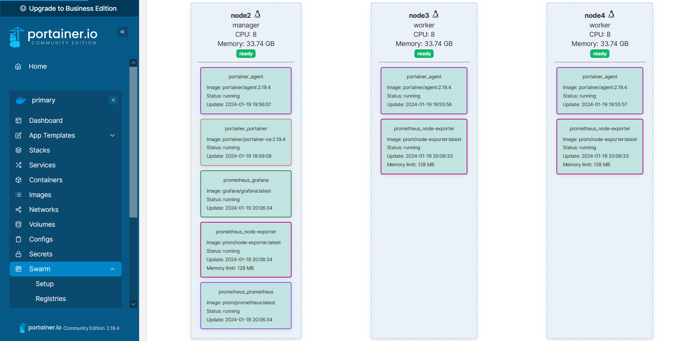
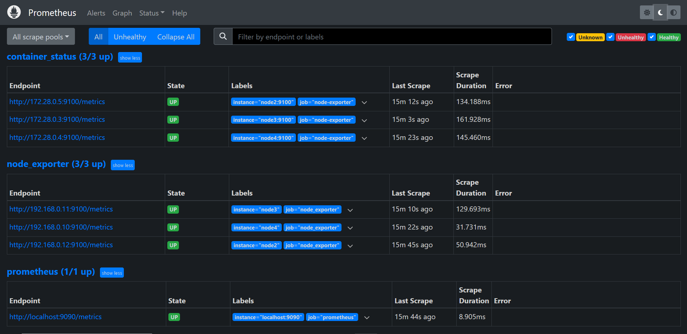
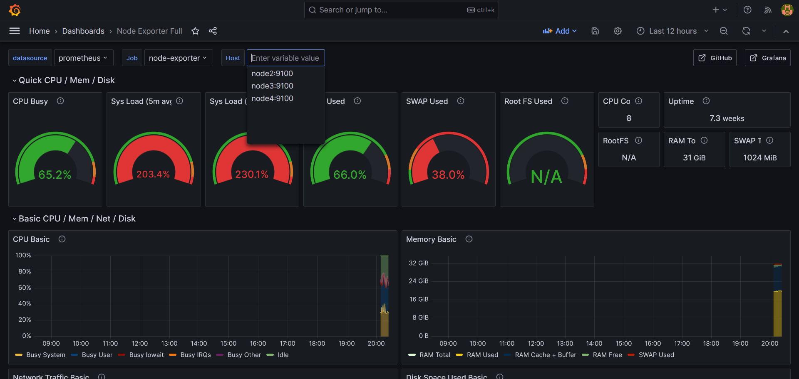

# Ansible Role: prometheus_swarm

Installs and configures prometheus for swarm cluster on Debian/Ubuntu servers.

## Requirements

No special requirements; note that this role requires root access, so either run it in a playbook with a global `become: yes`, or invoke the role in your playbook like:

```yaml
- hosts: cluster
  become: true
  roles:
    - prometheus_swarm
```

Specify root or any other user with sudo privileges as the remote user.
There are two ways you can do this:

### 1. ansible.cfg file

```ini
[defaults]
inventory = hosts.yml
private_key_file = ~/.ssh/cluster
stdout_callback = yaml
stderr_callback = yaml
remote_user = root
```

### 2. hosts file

```yaml
managers:
  hosts:
    master1:
      ansible_host: 192.168.0.109
workers:
  hosts:
    worker1:
      ansible_host: 192.168.0.110
    worker2:
      ansible_host: 192.168.0.110
cluster:
  children:
    managers:
    workers:
```

## Role Variables

Available variables are listed below, along with default values (see `defaults/main.yml`):

By default, this role will install docker and necessary packages. If you do not plan to install packages, update the install_packages variable to `no`.

```yaml
# Installation
install_packages: true
```

Packages to be installed. In some situations, you may need to add additional packages.

```yaml
# Define a custom list of packages to install
prep_packages:
  - apt-transport-https
  - ca-certificates
  - curl
  - gnupg-agent
  - software-properties-common
  - python3-pip

pip_packages:
  - docker
  - docker-compose

docker_packages:
  - docker-ce
  - docker-ce-cli
  - containerd.io
```

Default project-path settings. 
Copy the entire project into the files directory of the ansible role and specify the path to the project directory.
Or specify the relative path to your swarm project

```yaml
swarm_stacks_remote_dir: /opt/swarm_stacks/ # Project files destination
swarm_stacks_local_dir: swarm_stacks/ #role-directory/files/swarm_stacks
```

The value of the `swarm_state` variable controls the state of `docker swarm`.

```yaml
# Swarm cluster state.
swarm_state: 'create-deploy'
# create - create swarm cluster
# deploy - deploy stacks
# create-deploy - create swarm cluster and deploy stacks
# remove - remove stacks
# delete - delete swarm cluster
# remove-delete - remove stacks and delete swarm cluster
```

The values of the `deploy_stack_options` variable contain information about the stack file to be launched and its name when installed.

```yaml
# Deploy info
deploy_stack_options: []
# - stack_name: "stack_name"
#   filename: "file_name.yml"
# - stack_name: "stack_name"
#   filename: "file_name.yml"
```

The value of the `compose_state` variable controls the state of `docker-compose`.

```yaml
# Containers state.
compose_state: restart
# run - run and build containers
# stop - stop all containers
# restart - restart all containers
# rebuild - rebuild all containers
```

By default, the role deletes all stacks in the cluster. If you want to delete only the ones you need, set the `delete_all_stacks` variable to false and fill in all the necessary information for `remove_stack_options`.

```yaml
# Set to false if you want to remove stacks selectively
delete_all_stacks: true

# Names of stacks that will be deleted 
remove_stack_options: []
# - stack_name: "stack_name"
# - stack_name: "stack_name"
```

## Example Playbook

```yaml
- hosts: cluster
  become: true
  roles:
    - prometheus_swarm
```

*Inside `vars/main.yml`*:

```yaml
swarm_stacks_remote_dir: /opt/
swarm_stacks_local_dir: swarm_stacks/
swarm_state: 'create-deploy'

deploy_stack_options:
  - stack_name: "prometheus"
    filename: "prometheus.yml"
  - stack_name: "portainer"
    filename: "portainer.yml"

delete_all_stacks: true

remove_stack_options:
  - stack_name: "prometheus"
  - stack_name: "portainer"
```

# Preview
## 1. Portainer

## 2. Prometheus

## 3. Grafana


## License

MIT / BSD

## Author Information

This role was created in 2023 by [Nick Bykon](https://github.com/hikimory).
